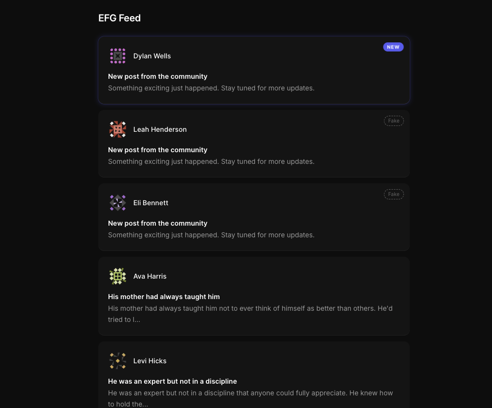

<div align="center">
  <h1>EFG Feed</h1>


  <br>
  
  <br>
  <br>
  <p>An infinite-scrolling post feed with real-time simulated updates, built with <strong>Next.js</strong>, <strong>TypeScript</strong>, <strong>Redux Toolkit</strong>, and <strong>Tailwind CSS</strong>.</p>
  <p><strong><a href="https://efg-games.vercel.app/" target="_blank" rel="noopener noreferrer">🚀 Live Demo</a></strong></p>
  <br>
</div>

## **📖 Description**

EFG Feed is an infinite-scrolling feed of posts with a post detail view and real-time post simulation. New posts arrive every 8 seconds and are highlighted with an entry animation and glow effect.

---

## ⚡ Quick Start

```bash
# 1. Install Bun (if not installed)
curl -fsSL https://bun.sh/install | bash

# 2. Clone the repository
git clone git@github.com:david-portilla/efg-games.git
cd efg-games

# 3. Install dependencies
bun install

# 4. Start development server
bun dev

# 5. Open http://localhost:3000 in your browser 🎉
```

**That's it!** No environment variables needed.

---

## **🚀 Live Demo**

👉 [efg-games.vercel.app](https://efg-games.vercel.app/)

---

## 🚀 Tech Stack

- **Runtime**: [Bun](https://bun.sh)
- **Framework**: [Next.js 16](https://nextjs.org) — App Router
- **Styling**: [Tailwind CSS v4](https://tailwindcss.com) — CSS-first config
- **State Management**: [Redux Toolkit](https://redux-toolkit.js.org) + RTK Query
- **Testing**: [Vitest](https://vitest.dev) + [React Testing Library](https://testing-library.com)
- **Quality**: ESLint, Prettier, Husky, Commitlint

---

## 📋 Prerequisites

- **Bun** v1.0.0 or higher ([Installation Guide](https://bun.sh/docs/installation))

```bash
# macOS/Linux
curl -fsSL https://bun.sh/install | bash

# Verify installation
bun --version
```

---

## 📜 Available Scripts

| Command | Description |
|---|---|
| `bun dev` | Start dev server (port 3000) |
| `bun run build` | Production build |
| `bun run test` | Run tests in watch mode |
| `bun run test:run` | Run tests once (CI mode) |
| `bun run lint` | Check for linting errors |
| `bun run format` | Format code with Prettier |

---

## 📁 Project Structure

```
efg-games/
├── .github/
│   └── workflows/
│       └── ci.yml              # GitHub Actions CI/CD pipeline
├── src/
│   ├── app/                    # Next.js routing — thin page wrappers only
│   │   ├── feed/page.tsx       # /feed route
│   │   ├── post/[id]/page.tsx  # /post/:id route
│   │   ├── globals.css         # Design tokens + Tailwind v4 theme
│   │   └── layout.tsx          # Root layout, Inter font, metadata
│   ├── features/
│   │   ├── feed/               # Feed list, PostCard, infinite scroll, new post simulator
│   │   ├── post/               # Post detail view
│   │   └── users/              # User API (cached ∞)
│   ├── shared/
│   │   ├── components/         # ErrorBoundary, ErrorFallback
│   │   └── lib/                # Redux store, RTK Query base API, hooks, providers
│   └── test/                   # Vitest setup, renderWithProviders helper
├── DECISIONS.md                # Architectural decisions for evaluators
└── package.json
```

---

## ✨ Features

- 📜 **Infinite scroll** — loads 20 posts per page via IntersectionObserver
- ⚡ **Real-time simulation** — new posts arrive every 8s via `POST /posts/add`
- 🎨 **New post animations** — slide-in entry, indigo glow, NEW badge
- 📄 **Post detail view** — full body, author avatar, dynamic page title
- 🔁 **Scroll restore** — returns to exact position after navigating back
- 🛡️ **Error boundaries** — contextual fallbacks (feed retry, post 404 vs generic)
- ♿ **Accessible** — `role="feed"`, `aria-live`, skip-to-content, reduced motion
- 📱 **Mobile responsive** — single-column, `max-w-2xl`, WCAG touch targets

---

## 🧪 Testing

```bash
bun run test       # Watch mode
bun run test:run   # CI mode — single run
```

- **38 tests** across 7 test files
- Unit tests: Redux slice, hooks (`useInfiniteScroll`, `useNewPostSimulator`)
- Component tests: `PostCard`, `PostDetail`
- Integration tests: `FeedList` infinite scroll + new post rendering

---

## 🔧 Troubleshooting

#### ❌ `bun: command not found`
Install Bun first — see [Prerequisites](#-prerequisites).

#### ❌ Port 3000 already in use
```bash
lsof -ti:3000 | xargs kill -9
```

#### ❌ `Cannot find module` errors
```bash
rm -rf node_modules
bun install
```

---

## 🤝 Contributing

### Branch & Commit Convention

- **Branch format**: `EFG-XXX-short-description`
- **Commit format**: `EFG-XXX: description`
- **Enforced by**: commitlint (via Husky commit-msg hook)

### Git Workflow

1. Branch from updated `main`
2. Make changes with proper commit messages
3. Run checks before pushing:
```bash
bun run lint && bun run test:run && bun run build
```
4. Open a Pull Request to `main`

---

## 📄 Architecture

See [DECISIONS.md](./DECISIONS.md) for detailed architectural decisions covering framework choice, state management, infinite scroll implementation, real-time simulation, error boundaries, performance optimizations, and accessibility.

---

<div align="center">
  Made with ❤️ by <a href="https://github.com/david-portilla">David Portilla</a>
</div>
